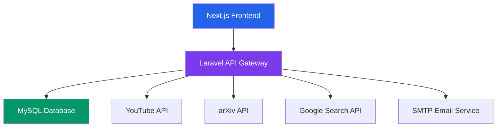

# 🎓 AcademVault - Intelligent Academic Research Platform

<p align='center'>
  
</p>

**AcademVault** is a modern, collaborative platform designed for researchers, students, and academics to discover, organize, and share academic resources. With intelligent search across multiple sources, secure collaboration features, and a beautiful dark-themed interface, AcademVault transforms how research is conducted.

## ✨ Key Features

### 🔍 **Intelligent Multi-Source Search**
- Search across **YouTube educational videos**, **arXiv research papers**, and **web articles** simultaneously
- Smart filtering by content type (videos, PDFs, articles)
- Save and organize search results into collections

### 👥 **Collaborative Research**
- Create shared collections with colleagues
- Discussion forums for research topics
- Friend system for academic networking
- Real-time notifications

### 📊 **Research Management**
- Dashboard with research analytics
- Document categorization and tagging
- Bookmark management system
- Activity tracking and history

### 🔒 **Enterprise Security**
- JWT-based authentication with email verification
- Role-based access control (Student/Teacher/Admin)
- Encrypted data storage
- GDPR compliant design

## 🚀 Quick Start

### 📦 Installation Methods

#### **Method 1: Docker (Recommended - Easiest)**
```bash
# 1. Clone & navigate
git clone https://github.com/yourusername/academvault.git
cd academvault

# 2. Configure environment
cp .env.example .env
# Edit .env with your settings (see Configuration below)

# 3. Launch with Docker
docker-compose up -d

# 4. Access the application:
# Frontend: http://localhost:3000
# Backend API: http://localhost:8000/api
# API Docs: http://localhost:8000
```

#### **Method 2: Manual Setup (For Developers)**
```bash
# Backend Setup (Laravel)
cd server
composer install
cp .env.example .env
# Configure .env file with your database & API keys
php artisan key:generate
php artisan jwt:secret
php artisan migrate --seed
php artisan serve --host=0.0.0.0 --port=8000

# Frontend Setup (Next.js - in new terminal)
cd client
npm install
npm run dev
# Access at: http://localhost:3000
```

### ⚙️ Configuration

#### **Environment Setup**
```env
# .env.example (copy to .env)
# Database
DB_CONNECTION=mysql
DB_HOST=mysql            # or localhost for manual setup
DB_PORT=3306
DB_DATABASE=AcademVault
DB_USERNAME=academ_vault_user
DB_PASSWORD=Secret123!

# JWT Auth (run: php artisan jwt:secret)
JWT_SECRET=base64:your_generated_secret_here

# Email Verification (Gmail recommended)
MAIL_USERNAME=your_email@gmail.com
MAIL_PASSWORD=your_app_password

# Optional API Keys (for enhanced search)
YOUTUBE_API_KEY=your_youtube_api_key
GOOGLE_SEARCH_API_KEY=your_google_search_api_key
GOOGLE_SEARCH_ENGINE_ID=your_search_engine_id
```

#### **Database Setup**
```sql
-- Create database manually (if not using Docker)
CREATE DATABASE AcademVault;
CREATE USER 'academ_vault_user'@'localhost' IDENTIFIED BY 'Secret123!';
GRANT ALL PRIVILEGES ON AcademVault.* TO 'academ_vault_user'@'localhost';
FLUSH PRIVILEGES;
```

### 📱 Screenshots

| Dashboard | Search Results | Mobile View |
|-----------|----------------|-------------|
|  |  |  |

| Email Verification | Collections | Discussions |
|--------------------|--------------|-------------|
|  |  |  |

## 🏗️ Architecture



### Tech Stack
- **Frontend**: Next.js 14, React 19, Tailwind CSS
- **Backend**: Laravel 12, PHP 8.2, JWT Authentication
- **Database**: MySQL 8.0 with advanced schema
- **Email**: Gmail SMTP with custom templates
- **Search**: YouTube Data API v3, arXiv API, Google Custom Search
- **Containerization**: Docker, Docker Compose

## 📁 Project Structure

```
AcademVault/
├── client/                 # Next.js 14 Frontend
│   ├── src/app/           # App Router pages
│   ├── src/lib/           # Auth, utilities
│   └── Dockerfile         # Production Docker config
├── server/                # Laravel 12 Backend
│   ├── app/Http/          # Controllers & Middleware
│   ├── database/          # Migrations & Seeders
│   └── Dockerfile         # Production Docker config
├── docker-compose.yml     # Production orchestration
├── .env.example           # Environment template
├── .env                   # Your configuration (create from .env.example)
└── screenshots/           # Application screenshots
```

## 🔧 API Configuration

### Required API Keys (Optional for Demo)
1. **YouTube Data API v3**
   - Enable from [Google Cloud Console](https://console.cloud.google.com/)
   - Used for educational video search

2. **Google Custom Search API**
   - Create from [Programmable Search Engine](https://programmablesearchengine.google.com/)
   - Used for web article search

3. **arXiv API**
   - No key required
   - Free academic paper search

### Email Configuration
- Uses Gmail SMTP with app passwords
- Custom HTML email templates
- Email verification for security
- **Note**: Demo works without email verification

## 🐳 Docker Services

| Service | Port | Description |
|---------|------|-------------|
| `frontend` | 3000 | Next.js application |
| `backend` | 8000 | Laravel API server |
| `mysql` | 3306 | MySQL database |

### Docker Commands
```bash
# Start services
docker-compose up -d

# View logs
docker-compose logs -f

# Stop services
docker-compose down

# Reset everything (including database)
docker-compose down -v
```

## 🛠️ Development

### Local Development (Without Docker)
```bash
# Backend
cd server
composer install
cp .env.example .env
php artisan key:generate
php artisan jwt:secret
php artisan migrate --seed
php artisan serve

# Frontend
cd client
npm install
npm run dev
```

### Running Tests
```bash
# Backend tests
cd server
php artisan test

# Frontend tests
cd client
npm test
```

## 📊 Database Schema

The application uses 14 interconnected tables:

- **users** - User accounts with roles
- **documents** - Research documents and metadata
- **categories** - Document categorization
- **collections** - Grouped research materials
- **search_history** - User search queries
- **email_verifications** - Email verification codes
- **bookmarks** - Saved documents
- **friendships** - User connections
- **discussions** - Research discussions
- **notifications** - User notifications

## 🔍 API Endpoints

| Endpoint | Method | Description |
|----------|--------|-------------|
| `/api/auth/register` | POST | Register new user |
| `/api/auth/login` | POST | User login |
| `/api/auth/verify-email` | POST | Verify email with code |
| `/api/auth/send-verification` | POST | Send verification code |
| `/api/dashboard/stats` | GET | Get dashboard statistics |
| `/api/search` | POST | Search across sources |
| `/api/health` | GET | Health check |

## 🚨 Troubleshooting

### Common Issues
1. **Port Conflicts**
   ```bash
   # Check what's using port 3000 or 8000
   sudo lsof -i :3000
   sudo lsof -i :8000
   ```

2. **Email Verification Not Working**
   - Use Gmail App Password, not regular password
   - Check spam folder
   - Verify SMTP settings in .env

3. **Database Connection Errors**
   ```bash
   # Test MySQL connection
   mysql -u academ_vault_user -p -h localhost
   ```

4. **Verification Link 404 Error**
   - Ensure email verification link points to frontend (port 3000)
   - Update `FRONTEND_URL` in .env file

### Quick Fixes
```bash
# Rebuild Docker containers
docker-compose down
docker-compose build --no-cache
docker-compose up -d

# Reset database
docker-compose exec mysql mysql -u root -p
# Then: DROP DATABASE AcademVault; CREATE DATABASE AcademVault;
docker-compose exec backend php artisan migrate --seed
```

## 🤝 Contributing

We welcome contributions! Please see our [Contributing Guidelines](./CONTRIBUTING.md) for details.

1. Fork the repository
2. Create a feature branch (`git checkout -b feature/AmazingFeature`)
3. Commit changes (`git commit -m 'Add AmazingFeature'`)
4. Push to branch (`git push origin feature/AmazingFeature`)
5. Open a Pull Request

## 📄 License

This project is licensed under the MIT License - see the [LICENSE](./LICENSE) file for details.

## 🙏 Acknowledgments

- [Laravel](https://laravel.com) - The PHP Framework
- [Next.js](https://nextjs.org) - The React Framework
- [Tailwind CSS](https://tailwindcss.com) - CSS Framework
- [Font Awesome](https://fontawesome.com) - Icons
- [arXiv](https://arxiv.org) - Academic Papers API
- [YouTube Data API](https://developers.google.com/youtube/v3) - Video Search

## 📞 Support

For support, email support@academvault.com or create an issue in the GitHub repository.

---

**Made with ❤️ for the academic community**

⭐ **Star us on GitHub** if you find this project helpful!