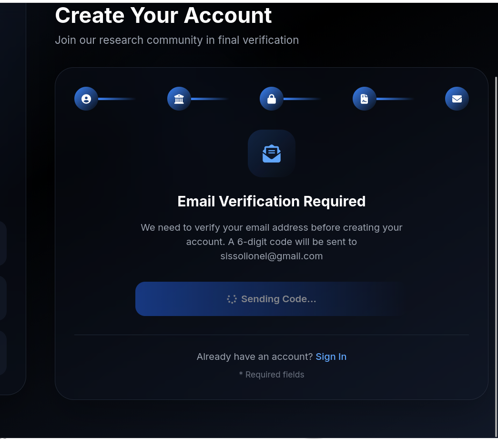
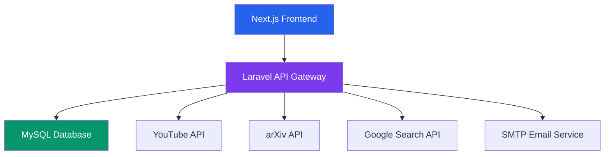

# 🎓 AcademVault - Intelligent Academic Research Platform


**AcademVault** is a modern, collaborative platform designed for researchers, students, and academics to discover, organize, and share academic resources. With intelligent search across multiple sources, secure collaboration features, and a beautiful dark-themed interface, AcademVault transforms how research is conducted.

## ✨ Key Features

### 🔍 **Intelligent Multi-Source Search**
- Search across **YouTube educational videos**, **arXiv research papers**, and **web articles** simultaneously
- Smart filtering by content type (videos, PDFs, articles)
- Save and organize search results into collections

### 👥 **Collaborative Research**
- Create shared collections with colleagues
- Discussion forums for research topics
- Friend system for academic networking
- Real-time notifications

### 📊 **Research Management**
- Dashboard with research analytics
- Document categorization and tagging
- Bookmark management system
- Activity tracking and history

### 🔒 **Enterprise Security**
- JWT-based authentication with email verification
- Role-based access control (Student/Teacher/Admin)
- Encrypted data storage
- GDPR compliant design

## 🚀 Quick Start with Docker

### Prerequisites
- Docker and Docker Compose installed
- At least 4GB RAM available
- Git

### Installation
```bash
# 1. Clone the repository
git clone https://github.com/yourusername/academvault.git
cd academvault

# 2. Copy environment configuration
cp .env.docker .env

# 3. Update .env with your API keys and email credentials
# Get API keys from: https://console.cloud.google.com/

# 4. Start the application
docker-compose up -d

# 5. Access the application
# Frontend: http://localhost:3000
# Backend API: http://localhost:8000/api
# PHPMyAdmin: http://localhost:8080 (optional)
```

### Default Login Credentials
- **Email**: test@academvault.com
- **Password**: password123

## 📱 Screenshots

| Dashboard | Search Results | Mobile View |
|-----------|----------------|-------------|
|  |  |  |

| Email Verification | Collections | Discussions |
|--------------------|--------------|-------------|
|  |  |  |

## 🏗️ Architecture



### Tech Stack
- **Frontend**: Next.js 14, React 19, Tailwind CSS
- **Backend**: Laravel 12, PHP 8.2, JWT Authentication
- **Database**: MySQL 8.0 with advanced schema
- **Email**: Gmail SMTP with custom templates
- **Search**: YouTube Data API v3, arXiv API, Google Custom Search
- **Containerization**: Docker, Docker Compose

## 📁 Project Structure

```
AcademVault/
├── client/                 # Next.js 14 Frontend
│   ├── src/app/           # App Router pages
│   ├── src/lib/           # Auth, utilities
│   └── Dockerfile         # Production Docker config
├── server/                # Laravel 12 Backend
│   ├── app/Http/         # Controllers & Middleware
│   ├── database/         # Migrations & Seeders
│   └── Dockerfile        # Production Docker config
├── docker-compose.yml    # Production orchestration
├── docker-compose.dev.yml # Development orchestration
└── screenshots/          # Application screenshots
```

## 🔧 API Configuration

### Required API Keys
1. **YouTube Data API v3**
   - Enable from Google Cloud Console
   - Used for educational video search

2. **Google Custom Search API**
   - Create custom search engine
   - Used for web article search

3. **arXiv API**
   - No key required
   - Free academic paper search

### Email Configuration
- Uses Gmail SMTP with app passwords
- Custom HTML email templates
- Email verification for security

## 🛠️ Development

### Local Development (Without Docker)
```bash
# Backend
cd server
composer install
cp .env.example .env
php artisan key:generate
php artisan jwt:secret
php artisan migrate --seed
php artisan serve

# Frontend
cd client
npm install
npm run dev
```

### Running Tests
```bash
# Backend tests
cd server
php artisan test

# Frontend tests
cd client
npm test
```

## 📊 Database Schema

The application uses 14 interconnected tables:

- **users** - User accounts with roles
- **documents** - Research documents and metadata
- **categories** - Document categorization
- **collections** - Grouped research materials
- **search_history** - User search queries
- **email_verifications** - Email verification codes
- **bookmarks** - Saved documents
- **friendships** - User connections
- **discussions** - Research discussions
- **notifications** - User notifications

## 🤝 Contributing

We welcome contributions! Please see our [Contributing Guidelines](./CONTRIBUTING.md) for details.

1. Fork the repository
2. Create a feature branch (`git checkout -b feature/AmazingFeature`)
3. Commit changes (`git commit -m 'Add AmazingFeature'`)
4. Push to branch (`git push origin feature/AmazingFeature`)
5. Open a Pull Request

## 📄 License

This project is licensed under the MIT License - see the [LICENSE](./LICENSE) file for details.

## 🙏 Acknowledgments

- [Laravel](https://laravel.com) - The PHP Framework
- [Next.js](https://nextjs.org) - The React Framework
- [Tailwind CSS](https://tailwindcss.com) - CSS Framework
- [Font Awesome](https://fontawesome.com) - Icons
- [arXiv](https://arxiv.org) - Academic Papers API
- [YouTube Data API](https://developers.google.com/youtube/v3) - Video Search

## 📞 Support

For support, email support@academvault.com or create an issue in the GitHub repository.

---

**Made with ❤️ for the academic community**

⭐ **Star us on GitHub** if you find this project helpful!
```

## 🎯 QUICK START COMMANDS

**File: `./QUICK_START.md`**
```markdown
# 🚀 AcademVault - Quick Start Guide

## Option 1: Docker (Recommended)
```bash
# Clone and start
git clone <repository-url>
cd AcademVault
docker-compose up -d

# View logs
docker-compose logs -f

# Stop containers
docker-compose down

# Reset everything
docker-compose down -v
```

## Option 2: Manual Installation
```bash
# Backend
cd server
composer install
cp .env.example .env
php artisan key:generate
php artisan jwt:secret
php artisan migrate --seed
php artisan serve --host=0.0.0.0 --port=8000

# Frontend (in new terminal)
cd client
npm install
npm run dev
```

## API Keys Setup
1. Get YouTube API key: https://console.cloud.google.com/
2. Get Google Search API key: https://programmablesearchengine.google.com/
3. Update `.env` file with your keys
4. Restart application

## Access Points
- 🌐 Web App: http://localhost:3000
- 🔧 API: http://localhost:8000/api
- 📊 Database: http://localhost:8080 (phpMyAdmin)
- 📧 Emails: Check Mailpit at http://localhost:8025 (if using mailpit)

## Default Accounts
- Admin: admin@academvault.com / admin123
- Test User: test@academvault.com / password123
- Teacher: teacher@academvault.com / teacher123